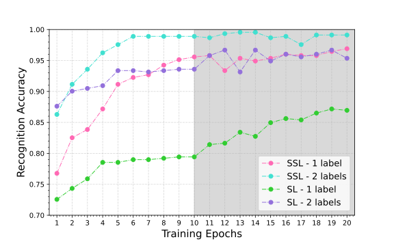
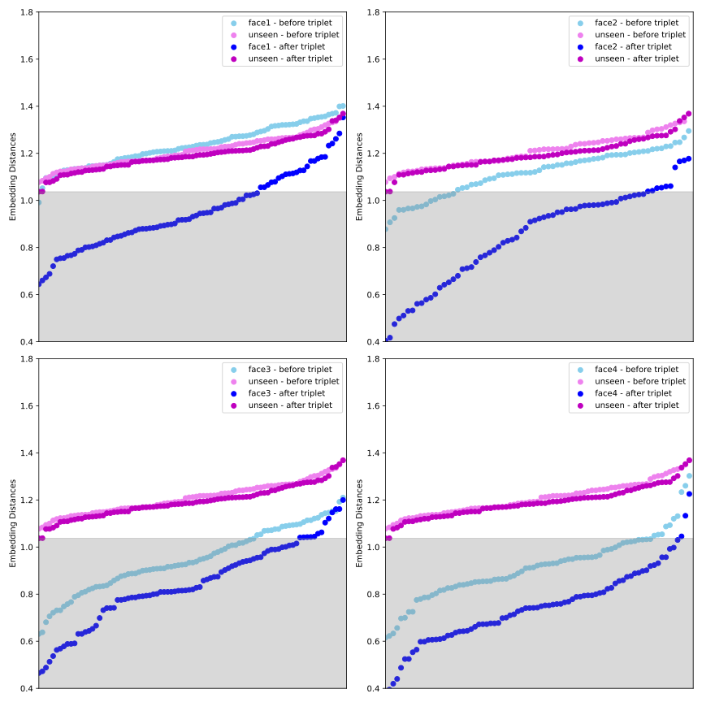
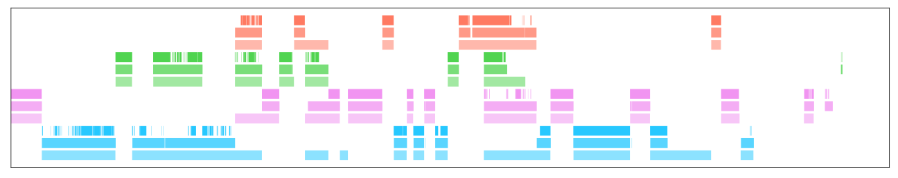

# ViCTer: A Semi-supervised Video Character Tracker

## Introduction
This repository contains the source code for the paper *ViCTer: A Semi-supervised Video Character Tracker*

Video character tracking problem refers to tracking certain characters of interest in the video and returning the appearing time slots for those characters. ViCTer is a novel model for address this problem by combining our proposed semi-supervised face recognition network with a [multi-human tracker](https://github.com/mikel-brostrom/Yolov5_StrongSORT_OSNet). We collect a dataset for the video character tracking problem, [Character Face in Video (CFIV)](https://ieee-dataport.org/documents/character-face-video), which can support various experiments for evaluating video character tracker performance. Our proposed model can achieve 70\% $\sim$ 80\% average intersection-over-union tracking accuracy on this dataset.     

## Installation
```
git clone --recurse-submodules https://github.com/Zilinghan/ViCTer
cd ViCTer
pip install -r requirements.txt
```

## Download Dataset
Download the dataset CIFV for running the experiment from the [*IEEEDataport*](https://ieee-dataport.org/documents/character-face-video), and put it under ViCTer/datasets in the following structure:
```
datasets
   |——————vct1
   └——————vct2
   └——————...
   └——————vct10
```
Then go to each ```vctX``` folder and run ```python youtube_download.py``` to download the video from Youtube.

## Tracking
```
python run.py --source datasets/vct2/vct2.mp4           # source video to track
              --face-folder datasets/vct2/face          # folder of face images of characters to be tracked
              --model-path model/vct2.pth               # path to store the trained recognition model
              --label-folder datasets/vct2/time_slot    # folder containing the ground truth character appearing time slots
              --stride 4                                # detect the movie for every 'stride' frame(s)
              --tracking-method ocsort                  # tracking algorithm (ocsort or strongsort)
              --save-vid                                # use only if you want to save video output
```

## Other Experiments
We have also provide codes for other experiments to evaluate the performance of ViCTer along several dimensions. Those codes are given as jupyter notebooks under the ```experiments``` folder.

[Face Recognition Accuracy](/experiments/exp1.ipynb)



[Embedding Distances](/experiments/exp2.ipynb)



[Embedding Clustering](/experiments/exp3.ipynb)


Tracking Results





